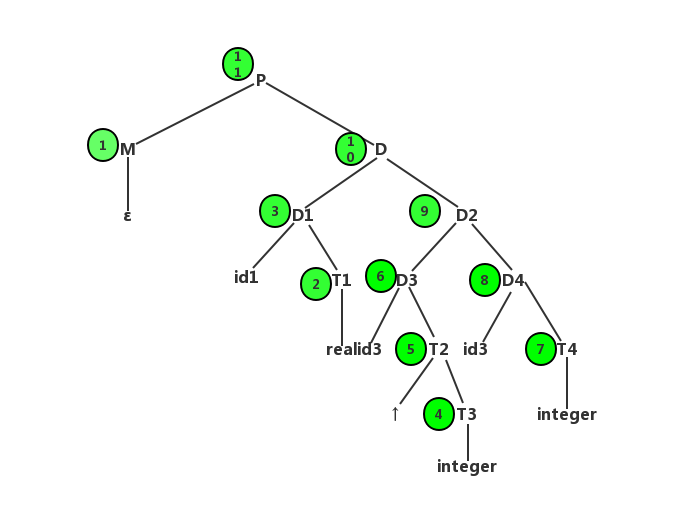

# 编译器

## 词法分析器
1. 待分析的简单词法
	1. 关键字：所有的关键字都是小写
        
        begin  if  then  while  do  end
    2. 运算符和界符
    
        :  :=  +  -  *  /  <  <=  <>  >  >=  =  ;  (  )  #
    3. 其他单词是标识符（ID）和整型常数（NUM），通过以下正规式定义：
    
    	ID = letter (letter | digit)*
    	
       NUM = digit digit*
    4. 空格有空白、制表符和换行符组成。空格一般用来分隔ID、NUM、运算符、界符和关键字，词法分析阶段通常被忽略。

2. 各种单词符号对应的种别码：

    单词符号 | 种别码 | 单词符号 | 种别码
    --- | --- | --- | ---
    begin | 1 | : | 17
    if | 2 | := | 18
    then | 3 | < | 20
    while | 4 | <>  21
    do | 5 | <= | 22
    end | 6 | > | 23
    letter（letter\|digit）* | 10 | >= | 24
    digit digit* | 11 | = | 25
    \+ | 13 | ; | 26
    \- | 14 | ( | 27
    \* | 15 | ) | 28
    / | 16 | # | 0

3. 测试句子:

    - begin x:=9; if x>9 then x:=2*x+1/3; end #
    - begin x:=9a; if x><9 then x<>2*x+1/3;, end #

4. 输出：
    
    二元组（syn,token或num）构成的序列。

## 语法分析器(LL(1)文法的预测分析)

1. 文法G[E]：

    E→TE’，E’→+TE’|ε，T→FT’，T’→*FT’|ε，F→(E) | i

2. 测试句子:

    - i+i*i$
    - i++i**i$
    - (i+i*i)+i$
    - i+i*i+$

## 语义分析器

1. 翻译模式:

    产生式规则 | 语义规则
    --- | ---
    P—>MD|{ addwidth(top(tblptr), top(offset)); pop(tblptr); pop(offset) }
    M—>ε | { t = mktable(nil); push(t,tblptr); push(0,offset)}
    D—>D1; D2 | 
    D—>proc id; N D1; S | { t = top(tblptr); addwidth(t,top(offset)); pop(tblptr); pop(offset); enterproc(top(tblptr), id.name, t) }
    D—>id:T | { enter(top(tblptr),id.name,T.type,top(offset)); top(offset) = top(offset) + T.width }
    N—>ε | { t = mktable(top(tblptr)); push(t,tblptr); push(0,offset) }
    T—>integer | { T.type = integer; T.width = 4 }
    T—>real | { T.type = real; T.width = 8 }
    T—>↑T1 | {T.type = pointer(T1.type); T.width = 4}

    tips:
    1. mktable(previous):创建一张新的符号表，并返回指向新表的指针。参数previous指向先前创建的符号，放在新符号表的表头。
    2. enter(table, name, type, offset)：在table指向的符号表中为名字name建立新表项，同时将类型type及相对地址offset放入该表项的属性域中。
    3. addwidth(table, width)：将table指向的符号表中所有表项的宽度之和记录在与符号表关联的表头中。
    4. enterproc(table, name, newtable)：在table指向的符号表中为过程name建立一个新表项，参数newtable指向过程name的符号表。
    5. 栈tblptr：保存指向外围过程符号表的指针。
    6. 栈offset：其栈顶元素是下一个当前过程中局部对象可用的相对地址。

2. 测试句子:
    1. id1:real;id2:^integer;id3:integer$
    2. id1:real;proc id2;id3:real;s$
    3. id1:^real;proc id2;id3:integer;s$
    4. id1:real;id2:^real;proc id3;id4:real;s; proc id5;id6:real;s;id7:real $
    5. 说明：s作为终结符号处理。 

3. 语法分析树
测试句子： id1 : real ; id2 :↑integer; id3:integer,其语法分析数如下：
